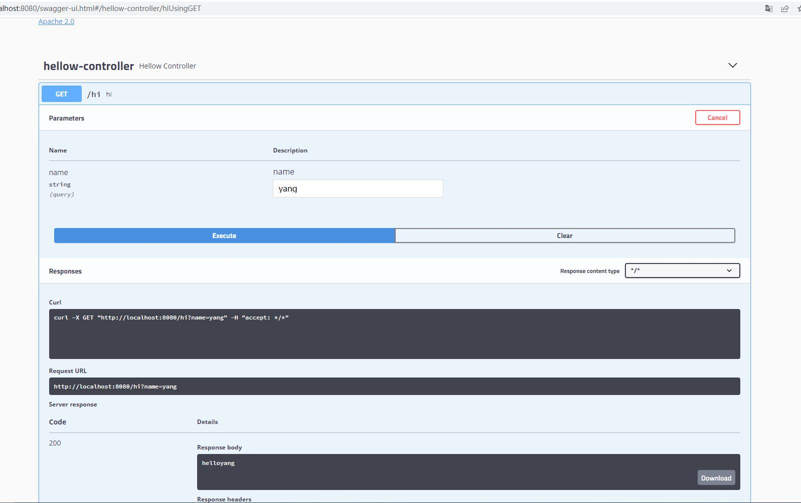

# springboot-swagger2

springboot+swagger2整合应用

> 参考: [https://segmentfault.com/a/1190000039413795](https://segmentfault.com/a/1190000039413795)
> 
> 官网API: [https://swagger.io/specification/v2/](https://swagger.io/specification/v2/)

## swagger2

swagger规范定义了一组描述此类API所需的文件, 用于描述和记录 RESTful API 的项目

## 使用

- 添加依赖

```
<!-- swagger2 -->
<dependency>
    <groupId>io.springfox</groupId>
    <artifactId>springfox-swagger2</artifactId>
    <version>2.9.2</version>
</dependency>
<dependency>
    <groupId>io.springfox</groupId>
    <artifactId>springfox-swagger-ui</artifactId>
    <version>2.9.2</version>
</dependency>
```

- 开启swagger, 添加 @EnableSwagger2开启注解

```
@EnableSwagger2
@SpringBootApplication
public class Swagger2Application { ...
```

- 配置摘要信息

```
@Configuration
public class SwaggerConfig {

    @Bean
    public Docket createRestApi() {
        return new Docket(DocumentationType.SWAGGER_2)
                .select()
                .apis(RequestHandlerSelectors.basePackage("com.yang.swagger2.controller"))
                .build();
    }
}
```

> 访问： http://localhost:8080/swagger-ui.html

